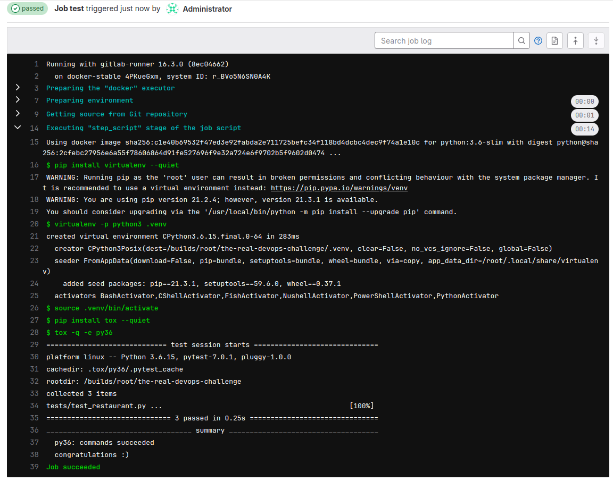
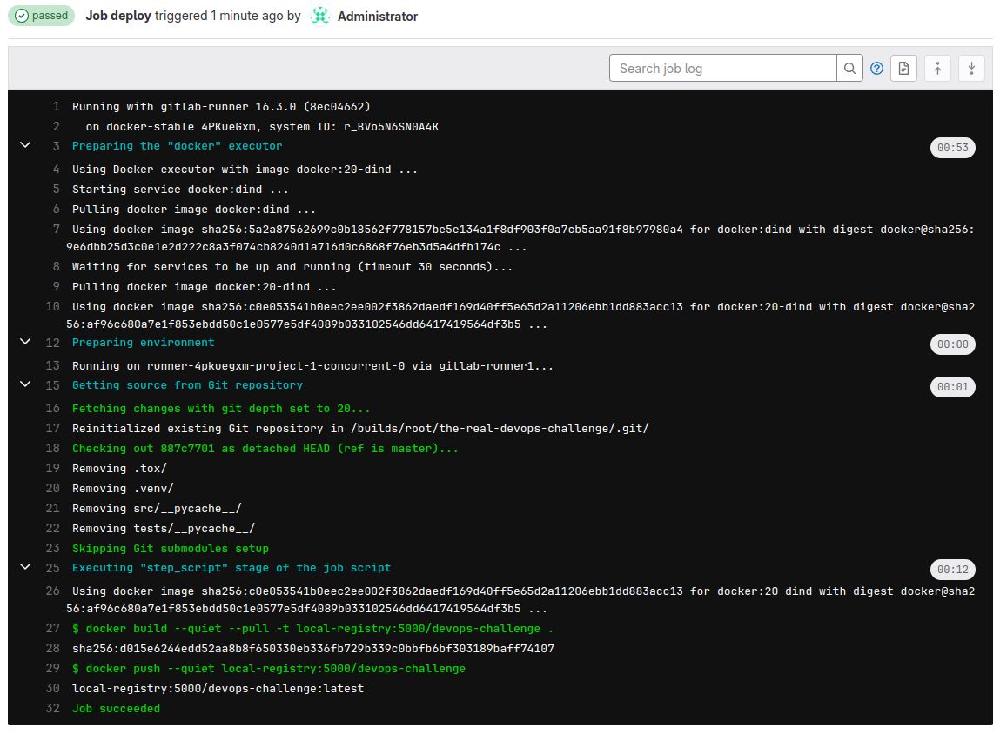

# Solutions for The real DevOps challenge

Challenge 1:

I declared a new find method for returning only one single result in JSON document format.


Challenge 2:

I created a gitlab-ci pipeline for testing and deploying the app.
```bash
stages:
  - test
  - deploy

services:
  - name: docker:dind
    command: ["--insecure-registry=local-registry:5000"]

variables:
  DOCKER_HOST: "tcp://docker:2375"
  DOCKER_TLS_CERTDIR: ""

test:
  stage: test
  image: python:3.6-slim
  before_script:
  - pip install virtualenv --quiet
  - virtualenv -p python3 .venv
  - source .venv/bin/activate
  script:
    - pip install tox --quiet
    - tox -e py36

deploy:
  stage: deploy
  script:
    - docker build -t javiervalero1/the-real-devops-challenge-app:latest -f Dockerfile.app .
    - docker push javiervalero1/the-real-devops-challenge-app:latest
```

Pipeline results:





Challenge 3:

I wrote a [Dockerfile](https://github.com/elvalerin/the-real-devops-challenge/blob/master/Dockerfile.app) for the app. I used a slim python base image for saving space.

Challenge 4:

I wrote a [Dockerfile](https://github.com/elvalerin/the-real-devops-challenge/blob/master/Dockerfile.mongo) 
for our mongo database. I use scripts for populating the database and creating the user and password.

Challenge 5:

I wrote a [docker-compose](https://github.com/elvalerin/the-real-devops-challenge/blob/master/docker-compose.yml) file for and easy deployment of the app and the mongo database.

Final challenge:

I wrote some yaml in kubernetes folder for deploying the app and the mongo database in a Kubernetes cluster.